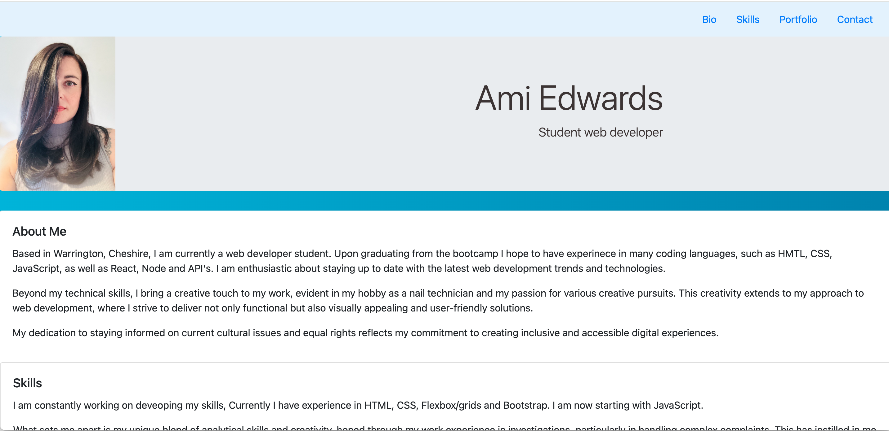

# Bootstrap-Portfolio

# User Story
AS A student developer
I WANT a webpage to showcase my new skills using Bootstrap
SO THAT potential employers and clients can see what I can do and want to hire me

## Accepted Criteria
A website that includes the following bootstrap components:

    - A Navigation bar

      - Including links that are applicable to my portfolio.
  
        - Links that navigate to the appropriate sections 

    - A hero section

        - A jumbotron featuring my picture, name, and  other information 

    - A work section

      - A section displaying my work in grid. 

      - Using bootstrap cards for each project.

        - A description giving a brief overview of my work.

      - Each project will eventually link to my class project work!

    - A skills section

      - List out the skills I expect to learn from the bootcamp.

    - An about / contact section.

      - An "About Me" section in the same row.
    
    - A footer section.

      - All hyperlinks should have a hover effect.

5. My Bootstrap solution should minimize use of media queries.

6. My new Bootstrap-powered portfolio is deployed to GitHub Pages.

